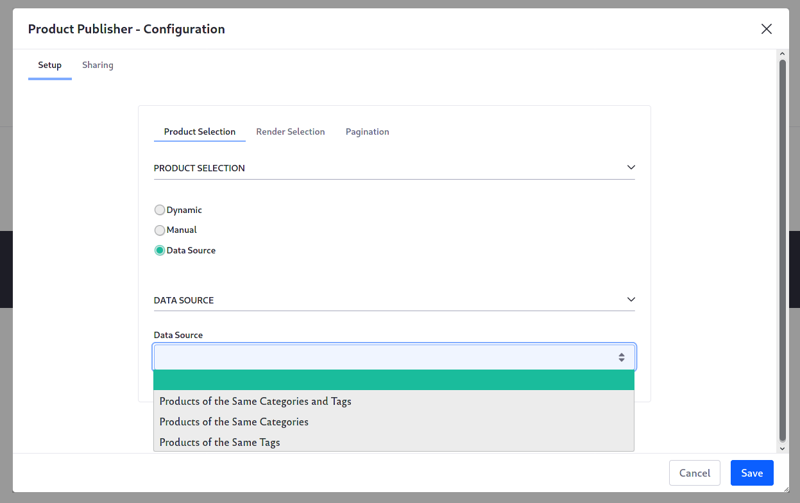
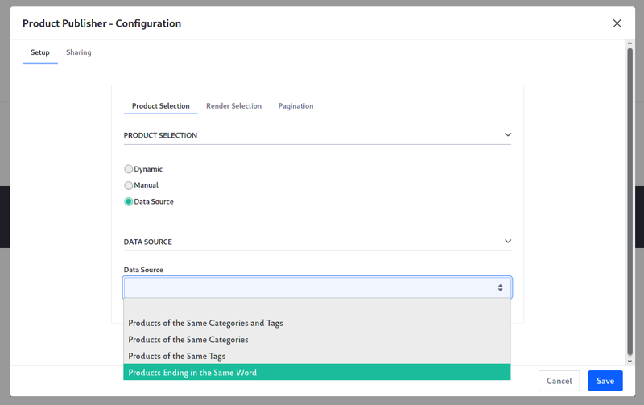

# Adding a New Product Data Source for the Product Publisher Widget

This tutorial will show you how to add a new product data source by implementing the `CPDataSource` interface.

Product data sources provide unique ways to search for products that are related. Liferay Commerce provides several product data sources out-of-the-box, including ones that search [by product relations](https://github.com/liferay/liferay-portal/blob/[$LIFERAY_LEARN_PORTAL_GIT_TAG$]/modules/apps/commerce/commerce-product-service/src/main/java/com/liferay/commerce/product/internal/data/source/CPDataSourceDefinitionLinkTypeImpl.java) and [by categories](https://github.com/liferay/liferay-portal/blob/[$LIFERAY_LEARN_PORTAL_GIT_TAG$]/modules/apps/commerce/commerce-product-service/src/main/java/com/liferay/commerce/product/internal/data/source/CPDataSourceAssetCategoriesImpl.java).



## Overview

1. [**Deploy an Example**](#deploy-an-example)
1. [**Walk Through the Example**](#walk-through-the-example)
1. [**Additional Information**](#additional-information)

## Deploy an Example

In this section, we will get an example product data source up and running on your instance of Liferay Commerce. Follow these steps:

1. Start Liferay Commerce.

    ```bash
    docker run -it -p 8080:8080 [$LIFERAY_LEARN_DXP_DOCKER_IMAGE$]
    ```

1. Download and unzip the [Acme Commerce Product Data Source](./liferay-m5x7.zip).

    ```bash
    curl https://learn.liferay.com/commerce/latest/en/developer-guide/liferay-m5x7.zip -O
    ```

    ```bash
    unzip liferay-m5x7.zip
    ```

1. Build and deploy the example.

    ```bash
    ./gradlew deploy -Ddeploy.docker.container.id=$(docker ps -lq)
    ```

    ```note::
       This command is the same as copying the deployed jars to ``/opt/liferay/osgi/modules`` on the Docker container.
    ```

1. Confirm the deployment in the Liferay Docker container console.

    ```bash
    STARTED com.acme.m5x7.impl_1.0.0
    ```

1. Verify that the example product data source was added. Open your browser to `https://localhost:8080` and navigate to a page with a Product Publisher widget. Click _Configuration_ for the Product Publisher, then select _Data Source_ under the _Product Selection_ section. The new product data source ("Products Ending in the Same Word") will be present under the _Data Source_ dropdown below.



Congratulations, you've successfully built and deployed a new product data source that implements `CPDataSource`.

Next, let's dive deeper to learn more.

## Walk Through the Example

In this section, we will review the example we deployed. First, we will annotate the class for OSGi registration. Second, we will review the `CPDataSource` interface. And third, we will complete our implementation of `CPDataSource`.

### Annotate Your Class for OSGi Registration

```java
@Component(
    property = "commerce.product.data.source.name=m5x7",
    service = CPDataSource.class
)
public class M5X7CPDataSource implements CPDataSource {
```

> The product data source name must be a unique value so that Liferay Commerce can distinguish the new data from existing data sources.

### Review the `CPDataSource` Interface

Implement the following methods:

```java
public String getLabel(Locale locale);
```

> This method returns a text label that describes how product data source will search for related products. See the implementation in [M5X7CPDataSource.java](https://github.com/liferay/liferay-learn/blob/master/docs/commerce/latest/en/developer-guide/adding-a-new-product-data-source-for-the-product-publisher-widget/resources/liferay-m5x7.zip/m5x7-impl/src/main/java/com/acme/m5x7/internal/commerce/product/data/source/M5X7CPDataSource.java) for a reference in retrieving the label with a language key.

```java
public String getName();
```

> This returns the name of the product data source.

```java
public CPDataSourceResult getResult(
        HttpServletRequest httpServletRequest, int start, int end)
    throws Exception;
```

> This will be where we add the business logic to perform the search for related products. The `HttpServletRequest` contains a reference to a particular product which the results should be related to in some way.
>
> The method will return a `CPDataSourceResult`, which contains a list of the search results; see the implementation at [CPDataSourceResult.java](https://github.com/liferay/liferay-portal/blob/[$LIFERAY_LEARN_PORTAL_GIT_TAG$]/modules/apps/commerce/commerce-product-api/src/main/java/com/liferay/commerce/product/data/source/CPDataSourceResult.java).

### Complete the Product Data Source

The product data source is comprised of logic to perform a search for related products. Do the following:

* [Add the search logic to `getResult`.](#add-the-search-logic-to-getresult)
* [Add the language key to `Language.properties`.](#add-the-language-key-to-languageproperties)

#### Add the Search Logic to `getResult`

```java
@Override
public CPDataSourceResult getResult(
        HttpServletRequest httpServletRequest, int start, int end)
    throws Exception {

    CPCatalogEntry cpCatalogEntry =
        (CPCatalogEntry)httpServletRequest.getAttribute(
            CPWebKeys.CP_CATALOG_ENTRY);

    if (cpCatalogEntry == null) {
        return new CPDataSourceResult(new ArrayList<>(), 0);
    }

    return _cpDefinitionHelper.search(
        _portal.getScopeGroupId(httpServletRequest),
        new SearchContext() {
            {
                setAttributes(
                    HashMapBuilder.<String, Serializable>put(
                        Field.STATUS, WorkflowConstants.STATUS_APPROVED
                    ).put(
                        "excludedCPDefinitionId",
                        cpCatalogEntry.getCPDefinitionId()
                    ).build());
                setCompanyId(_portal.getCompanyId(httpServletRequest));
                setKeywords(
                    StringPool.STAR + _getLastWordOfName(cpCatalogEntry));
            }
        },
        new CPQuery(), start, end);
}
```

> We use a [CPDefinitionHelper](https://github.com/liferay/liferay-portal/blob/[$LIFERAY_LEARN_PORTAL_GIT_TAG$]/modules/apps/commerce/commerce-product-service/src/main/java/com/liferay/commerce/product/internal/util/CPDefinitionHelperImpl.java) to perform the search. The `CPDefinitionHelper` combines logic specific to product definitions with `BaseIndexer`'s search functionality; see [BaseIndexer.java](https://github.com/liferay/liferay-portal/blob/[$LIFERAY_LEARN_PORTAL_GIT_TAG$]/portal-kernel/src/com/liferay/portal/kernel/search/BaseIndexer.java) for more information.
>
> Add the product definition's ID as the value for the `"excludedCPDefinitionId"` attribute to the `SearchContext`. This will omit the original product from the results. In our example, we also specify the last word of the product name to search for. For details, see the search logic implementation in the example `M5X7CPDataSource.java` file's `_getLastWordOfName` method.

#### Add the Language Key to `Language.properties`

Add the language key and its value to a [Language.properties](https://github.com/liferay/liferay-learn/blob/master/docs/commerce/latest/en/developer-guide/adding-a-new-product-data-source-for-the-product-publisher-widget/resources/liferay-m5x7.zip/m5x7-impl/src/main/resources/content/Language.properties) file within our module:

```properties
products-ending-in-the-same-word=Products Ending in the Same Word
```

> See [Localizing Your Application](https://help.liferay.com/hc/en-us/articles/360018168251-Localizing-Your-Application) for more information.

## Conclusion

Congratulations! You now know the basics for implementing the `CPDataSource` interface, and have added a new product data source to Liferay Commerce.

## Additional Information

* [Localizing Your Application](https://help.liferay.com/hc/en-us/articles/360018168251-Localizing-Your-Application)
* [Related Products, Up-Sells, and Cross-Sells](../../managing-a-catalog/creating-and-managing-products/products/related-products-up-sells-and-cross-sells.md)
