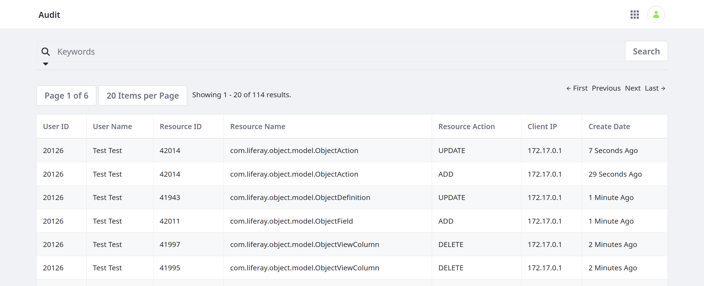
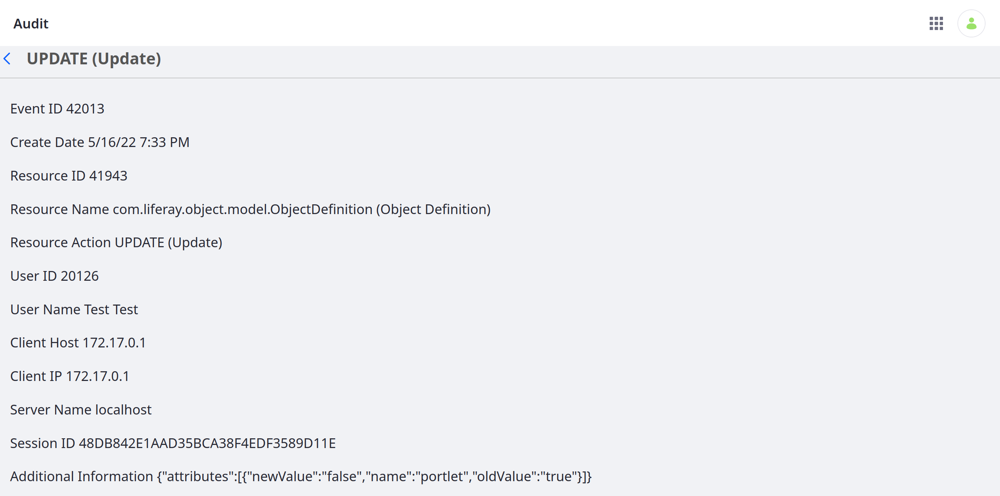

# Auditing Object Definition Events

The Objects application is integrated with Liferay's Audit framework, so you can keep track of events related to Object definitions. The Audit application lists these events in a table and includes both user and resource information. 

To access the Audit application, open the *Global Menu* (), go to the *Control Panel* tab, and click *Audit*.

The table includes the following columns:

| Column | Description |
| :--- | :--- |
| User ID | ID of the acting user |
| User Name | Name of the acting user |
| Resource ID | ID of the affected resource |
| Resource Name | Name of the affected resource |
| Resource Action | Action performed (`ADD`, `UPDATE`, or `DELETE`) |
| Client IP | IP address responsible for the action |
| Create Date | When the event record was created |

You can click on any event field to view more a more complete record, including specific action details.

If desired, you can search and filter results using keywords and other facets.

## Additional Information

* [Objects](../objects.md)
* [Creating and Managing Objects](./creating-and-managing-objects.md)
