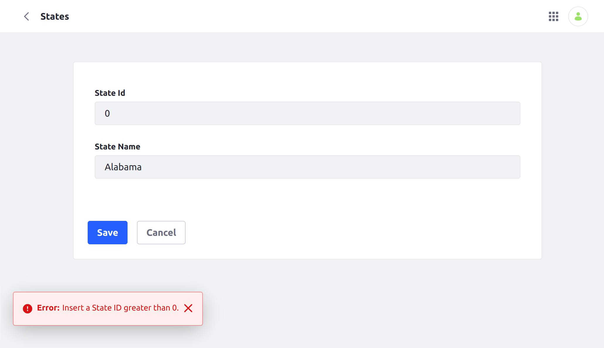
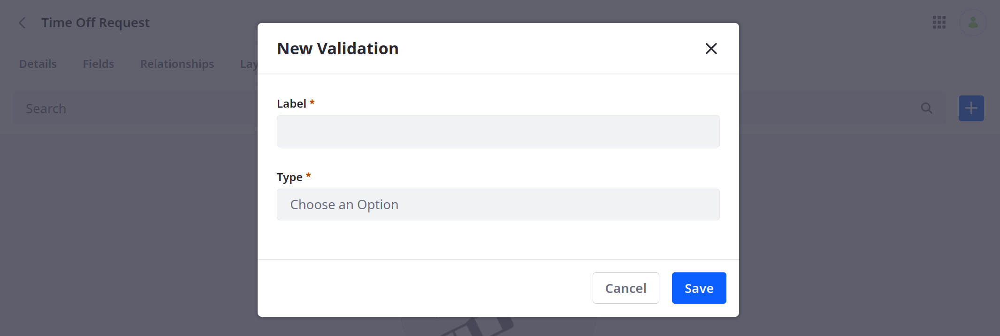
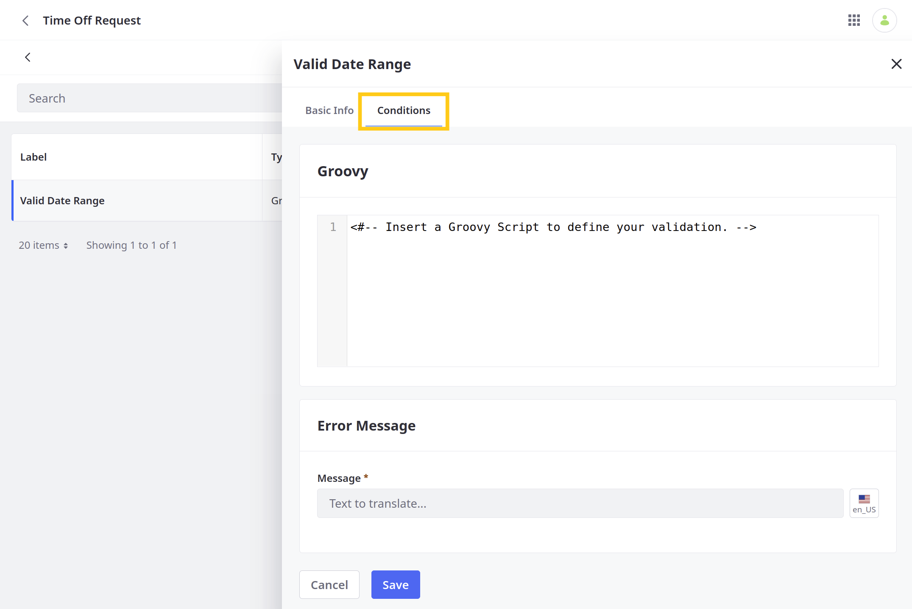
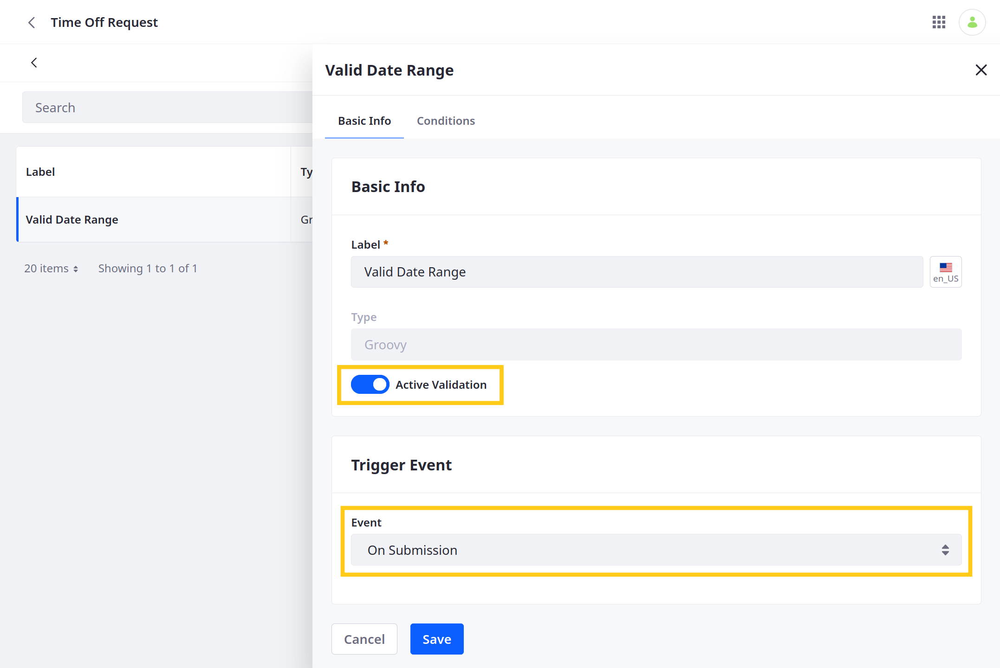

# Adding Custom Validations

{bdg-secondary}`Available Liferay 7.4 U25+ and GA25+`

With custom Objects, you can add validations for both custom and metadata fields. Validations set rules used for determining valid field entries and can be defined using either [Groovy](https://groovy-lang.org/) scripts or Liferay's [expression builder](./expression-builder-validations-reference.md). Each validation has its own trigger, conditions, and error text, which you can set via the Objects UI. When triggered, the validation checks for valid field entires according to your defined conditions and displays your error text for invalid entries.



```{note}
The desired data fields must exist before you can create validations for them.
```

Follow these steps to add a custom validation:

1. Open the *Global Menu* (), click the *Control Panel* tab, and go to *Objects*.

1. Begin editing a custom Object.

1. Go to the *Validations* tab and click the *Add* button ().

1. Enter a *label* and select a validation type: *Groovy* or *Expression Builder*.

   

1. Click *Save*.

1. Begin editing the newly created validation.

1. Go to the *Conditions* tab and add conditions to the validation.

   

   When using Groovy, you can browse and add available data fields to your conditions via the side panel. See [Using Groovy Validations](#using-groovy-validations) for more information.

   When using Expression Builder, you can browse and add fields, operators, and functions to your conditions via the side panel. See [Using Expression Builder Validations](#using-expression-builder-validations) for more information.

   ```{tip}
   Conditions can include multiple fields and functions for complex validations.
   ```

1. Enter a localizable *error message*. This message is displayed whenever the validation is triggered and field entries do not meet one or more of the defined conditions.

1. Go to the *Basic Info* tab and *activate* the validation.

1. Select a *Trigger Event* to determine when the validation is run for field entries: on entry submission, creation, or update.

   ```{note}
   Each validation can only have one trigger event.
   ```

   

1. Click *Save*.

Once activated, the validation is run for all new Object entries.

## Using Groovy Validations

{bdg-secondary}`Available Liferay DXP U24 and Portal GA24`

The Groovy validation type supports all standard Groovy Script capabilities. However, when defining Groovy conditions, you must use the `invalidFields` variable and set its initial value to either `true` or `false`. Once set, `invalidFields` returns `true` whenever a field entry is invalid, while `false` is returned whenever it is valid. The error message is only displayed to users when `invalidFields` returns `true`.

```{note}
The Groovy type does not currently have a check syntax validation.
```

## Using Expression Builder Validations

{bdg-secondary}`Available Liferay DXP U25 and Portal GA25`

The Expression Builder type provides predefined fields, operators, and functions that you can access in the conditions side panel. Clicking an element adds it to the conditions editor. These functions return a Boolean value. For some, `true` indicates an valid entry, while for others `true` indicates an invalid entry. See [Expression Builder Validations Reference](./expression-builder-validations-reference.md) for a complete list of provided operators and functions.

```{important}
Expression Builder validations can only be used with text, numeric, date, and boolean field types.
```

## Available Fields Reference

When constructing conditions, you can use any of the Object's custom or metadata fields. You can also select from relationship fields on the 'one' side of a relationship.

The following chart lists all default metadata fields included in custom Objects:

| Field | Description |
| :--- | :--- |
| `companyId` | ID of the company in which the entry was created |
| `createDate` | When the entry was created |
| `externalReferenceCode` | External reference code for the entry |
| `groupId` | ID of the group in which the entry was created |
| `lastPublishDate` | Date when the entry was last published<!--correct?--> |
| `modifiedDate` | Date when the entry was last modified<!--correct?--> |
| `mvccVersion` | MVCC version of the entry<!--correct?--> |
| `objectDefinitionId` | ID of the entry's Object |
| `objectEntryId` | ID for the entry |
| `status` | Workflow status for the entry |
| `statusByUserId` | ID of the assigned user<!--correct?--> |
| `statusByUserName` | Name of the assigned user<!--correct?--> |
| `statusDate` | Date when the status was list updated |
| `userEmailAddress` | Email address for the entry's author |
| `userFirstName` | First name of the entry's author |
| `userId` | ID of the entry's author |
| `userLastName` | Last name of the entry's author |
| `userName` | Full name of the entry's author |
| `uuid` | Unique universal ID for the entry<!--correct?--> |

```{note}
Besides custom fields, the following metadata fields are listed in the editing sidebar for easy access:

* Author (`userName`)
* Created Date (`createDate`)
* ID (`objectEntryId`)
* Modified Date (`lastPublishDate`)
* User Email (`userEmailAddress`)
* Workflow status (`status`)
```

## Additional Information

* [Creating Objects](./creating-objects.md)
* [Adding Fields to Objects](./adding-fields-to-objects.md)
* [Expression Builder Validations Reference](./expression-builder-validations-reference.md)