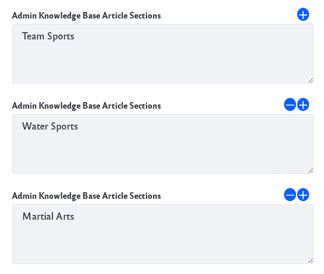

# Knowledge Base System Settings

Administrators can use the System Settings UI to set the Knowledge Base’s global configuration (across Sites). You can access this UI in *Control Panel* &rarr; *Configuration* &rarr; *System Settings* &rarr; *Knowledge Base*. There are five sections of Knowledge Base configuration settings:

* Knowledge Base Service
* Knowledge Base Article
* Knowledge Base Display
* Knowledge Base Search
* Knowledge Base Section

The *Knowledge Base Service* section’s settings apply defaults to all the Knowledge Base widgets, and to the Knowledge Base app in Site Administration. The other sections apply to specific Knowledge Base widgets and override the *Knowledge Base Service* defaults.

```important::
   Advanced configuration of the Knowledge Base application’s system settings should only be performed by a Liferay DXP administrator.
```

The Knowledge Base has several optional features that are disabled by default, but can be enabled and configured from System Settings. These include importer file conventions, new article priority increment, source URL, and section names.

## Importer File Convention Settings

These settings define the supported file extensions, the suffix for parent files, and the image folder’s path within the imported ZIP files. These settings are accessible in the *Knowledge Base Service* section of the Knowledge Base’s System Settings.

The following settings specify the importer’s supported file extensions:

**Markdown Importer article extensions:** Sets the supported article extensions. The default values are `.markdown` and `.md`.

**Markdown Importer Image File Extensions:** Sets the supported image file extensions. The default values are `.bmp`, `.gif`, `.jpeg`, `.jpg`, and `.png`.

To modify the supported file extensions,

1. Click the + or - button next to the setting to add or remove a supported file extension, respectively.

1. If adding an extension, enter a new value.

1. Click *Save*.

These settings define additional article configuration options for the importer:

**Markdown Importer Article Intro:** Sets the parent article’s file suffix. The default value is `intro.markdown`.

**Markdown Importer Image Folder:** Sets the image folder path the importer looks for in the ZIP file. The default path is `/images`.

**Article Increment Priority Enabled:** Whether to increment new article priorities by `1.0`. To disable this increment so that articles get a flat value of `1.0`, deselect the checkbox.

Alternatively, you can enable or disable the article increment priority feature for each widget in the corresponding widget’s configuration menu in System Settings.

## Source URL Settings

The source URL settings define the source location of Markdown files for import. This should point to a source repository where the files are stored. GitHub is assumed as the default. Once defined, the Knowledge Base displays a button (default label is *Edit on Github*) above each displayed article. Users can click the button to navigate to an article’s source location.

The source URL settings are accessible in the *Knowledge Base Service* section of the Knowledge Base’s System Settings. To enable the source URL, check the *Source URL Enabled* checkbox.

To change the source URL button’s label, specify a new value for the setting *Source URL Edit Message Key*. Best practice is to specify the value as a language key. For example, if you create a language key `edit-on-bitbucket=Edit on Bitbucket`, you can specify that language key as the button’s new label:

    edit-on-bitbucket

Alternatively, you can specify the label explicitly: 

    Edit on Bitbucket

## Section Names Setting

The section names setting is for specifying names of arbitrary topics to attribute to articles. Using the *Knowledge Base Section* widget, you can display one or more sections (groups) of articles. To use sections, you must first define them in the System Settings for the *Knowledge Base Section* widget.

To make new sections,

1. Navigate to the *Knowledge Base Section* configuration menu.

1. Click the plus button next to the *Admin Knowledge Base Article Sections* setting to add a new field for each section you want.

    

1. Enter a name for each new section and click *Save*.

Once your sections are added, you can follow the steps in the [Knowledge Base Section documentation](other-knowledge-base-widgets.md#knowledge-base-section-widget) to learn how to use them.
