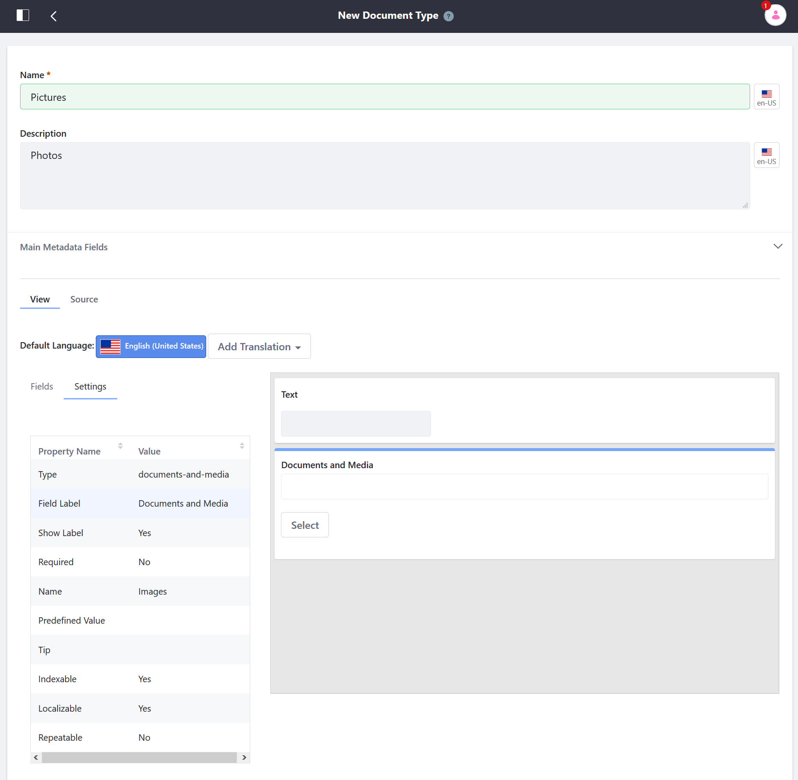
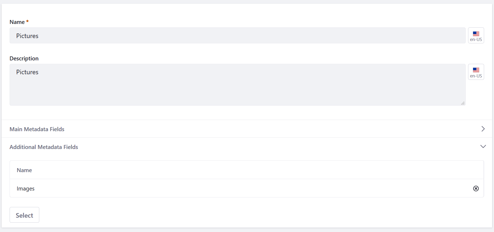
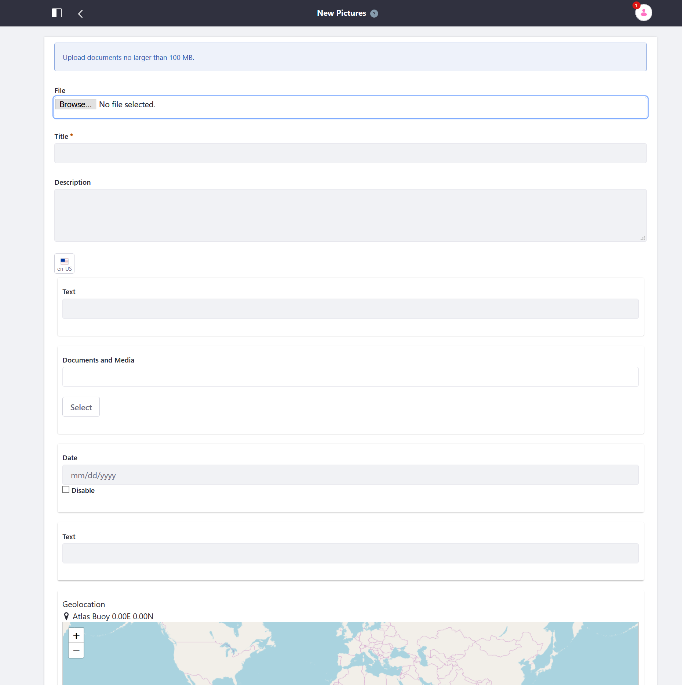

# Defining Document Types

Document types are made of metadata fields and help users define the purpose of Document Library files. Document types also help users integrate files with other features like [search](../../../../using-search/getting-started/search-overview.md) and [workflow](../../../../process-automation/workflow/introduction-to-workflow.md).

To create a document type:

1. Open the _Product Menu_ () then click the compass icon () on the _Site Administration_ menu.
1. Select the site where the form will be created.
1. Click _Content & Data_  &rarr; _Documents and Media_.
1. Click the _Document Types_ tab.
1. Click the _Add button_ (). The _New Document Type_ form appears.
1. Enter a name.
1. Enter a description.
1. Expand the _Main Metadata Fields_ section.
1. Drag and drop the metadata fields into the editor.

    

1. Expand the _Additional Metadata Fields_.
1. Select a metadata set to associate with the document type. To learn more, see [Using Metadata Sets](./using-metadata-sets.md).

    

1. Click _Save_.

The new Document Type is now available when adding a document via the Documents and Media's _Add_ menu.

When users create new files of the document type, they're presented with metadata fields to describe the document.

## Additional Information

* [Using Metadata Sets](./using-metadata-sets.md)
