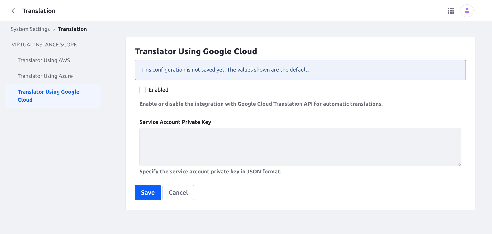
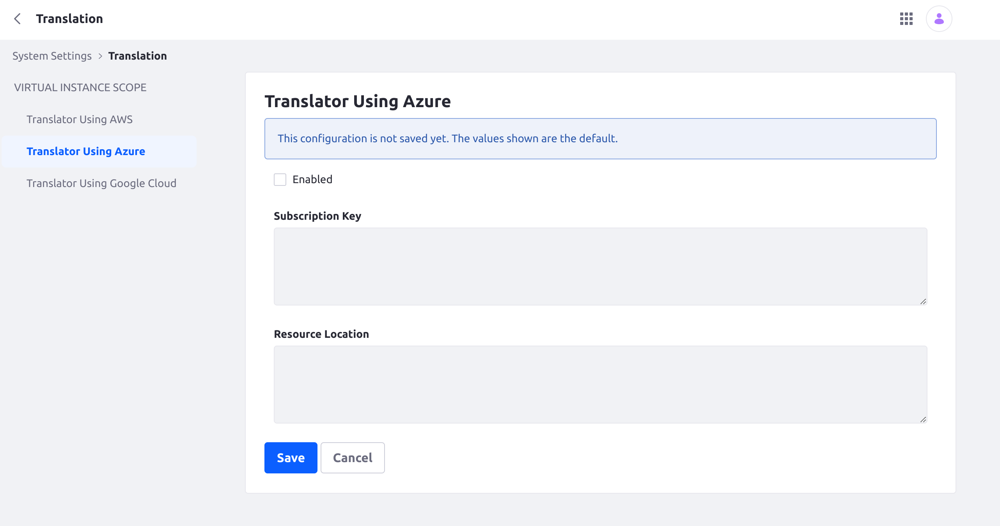
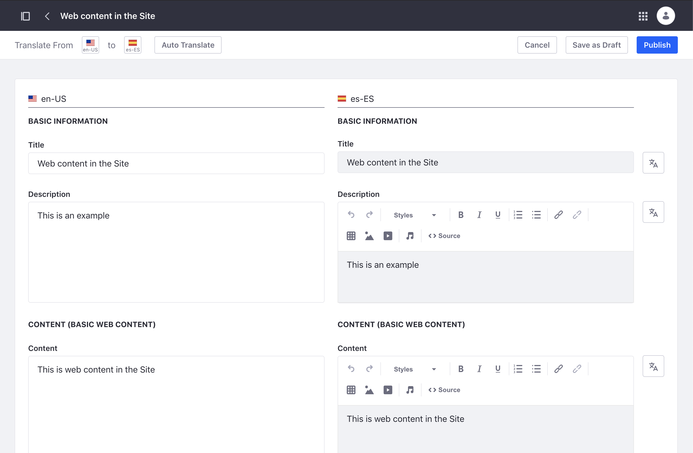
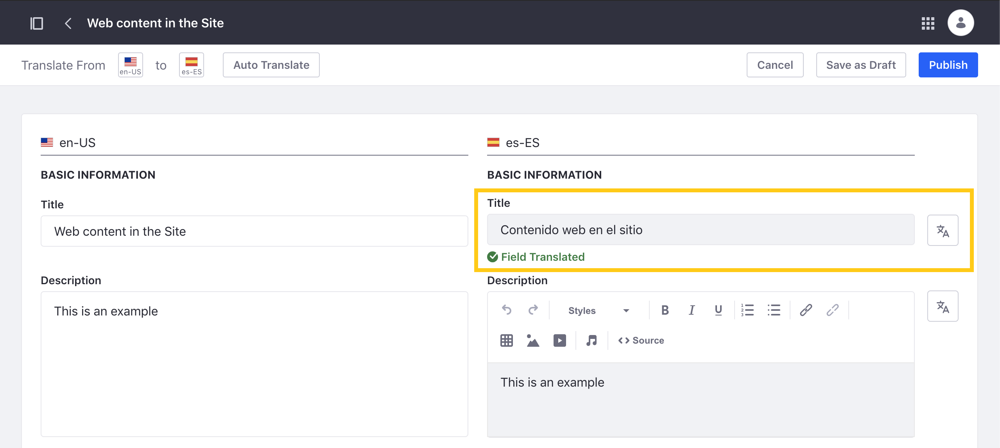

# Using Third Parties for Translation

{bdg-secondary}`Available Liferay 7.4 U15+ and GA15+`

Liferay can integrate with the following service APIs to generate automatic translations of Content Pages and Web Content.

* [Google Cloud Translation](#enabling-google-cloud-translation)
* [Amazon Translate](#enabling-amazon-translate)
* [Microsoft Translator](#enabling-microsoft-translator)

To use this feature, you must first set up the translation service you are using and then enable it in Liferay's system settings. Once enabled, you can use the service to [generate translations](#using-automatic-translation) for Content Pages and Web Content.

```{important}
Only one service can be active at a time. If you enable multiple services, the system uses the first one available.
```

## Enabling Google Cloud Translation

Enabling Google Cloud Translation requires an active account and a Google Cloud project with Cloud Translation API enabled. This project must also have a service account with a JSON account key. See official [Google Cloud Translation](https://cloud.google.com/translate/docs/setup) documentation for more information.

When ready, follow these steps:

1. Open the *Global Menu*(), click the *Control Panel* tab, and go to *System Settings* &rarr; *Translation* &rarr; *Translator Using Google Cloud*.

   

1. Check *Enabled*.

1. Enter a valid Google Cloud service account key in JSON format.

1. Click *Save*.

## Enabling Amazon Translate

{bdg-secondary}`Available 7.4 U9+ and GA13+`

Enabling Amazon Translate requires an active Amazon AWS account. See official [Amazon Translate](https://docs.aws.amazon.com/translate/latest/dg/what-is.html) documentation for more information.

When ready, follow these steps:

1. Open the *Global Menu*(), click the *Control Panel* tab, and go to *System Settings* &rarr; *Translation* &rarr; *Translator Using AWS*.

   

1. Check *Enabled*.

1. Enter a valid *Access Key* and *Secret Key*.

1. Enter your region. The default value is `us-west-1`.

1. Click *Save*.

## Enabling Microsoft Translator

{bdg-secondary}`Available 7.4 U6+ and GA10+`

Enabling Microsoft Translator requires an active Microsoft Azure account. See official [Microsoft Translator](https://docs.microsoft.com/en-us/azure/cognitive-services/translator/) documentation for more information.

When ready, follow these steps:

1. Open the *Global Menu*(), click the *Control Panel* tab, and go to *System Settings* &rarr; *Translation* &rarr; *Translator Using Azure*.

   

1. Check *Enabled*.

1. Enter a valid *Subscription Key* and *Resource Location* (region).

1. Click *Save*.

## Using Automatic Translation

Once a translation service is enabled, auto translate buttons are added to the translation interface for Content Pages and Web Content.

Follow these steps to automatically translate fields:

1. Open the *Pages* or *Web Content* application.

1. Click the *Actions* button () for the content or Page you want to translate and select *Translate*.

   

1. Use the language flags to select the *languages* you want to translate.

   ```{note}
   The languages available for translation are determined by your instance's localization settings. See [Initial Instance Localization](../installation-and-upgrades/setting-up-liferay/initial-instance-localization.md) and [Virtual Instance Localization](../system-administration/configuring-liferay/virtual-instances/localization.md) for more information.
   ```

1. Click the *Auto Translate* button to translate all Web Content fields into the selected language.

   

   Alternatively, click a field's individual *Auto Translate* button () to only translate its text.

   

1. Click *Save as Draft* or *Publish* when finished.

## Additional Information

* [Translating Web Content](./translating-web-content.md)
* [Translating Content Pages](./translating-content-pages.md)
