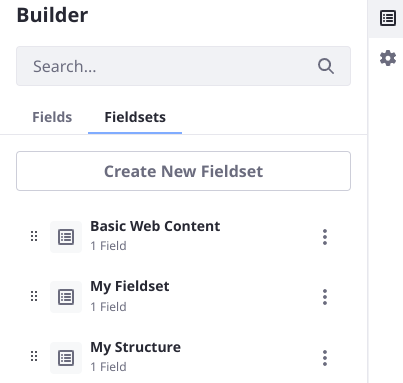
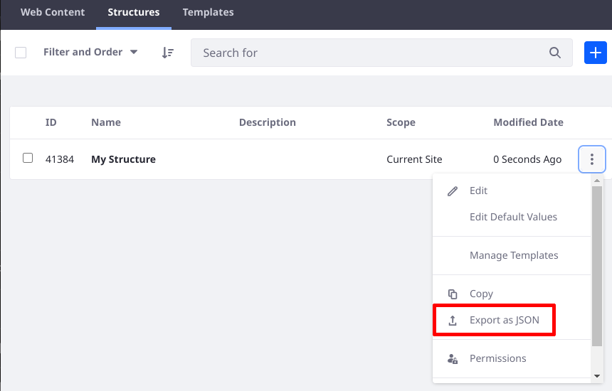
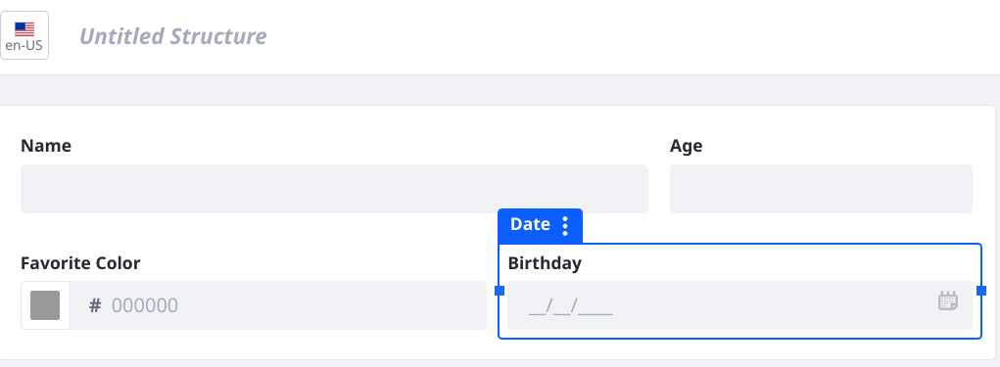

# What's New with Web Content Structures in 7.4?

As of Liferay 7.4, Web Content Structures have been migrated from using Dynamic Data Mapping (DDM) to Data Engine (DE) as the back-end framework for building forms.


The framework name and implementation details are unimportant, but understanding the changes and enhancements they bring to your Web Content Structures is in your interests. 

## New and Improved Field Types

Field types have been added and improved as part of the move to Data Engine:

- The Select from List field's options are ordered alphabetically.
- Configure a Numeric field as an integer or decimal field.
- The Grid field is a new field type in Web Content and Documents and Media. See the [Forms Field Type Reference](../../../process-automation/forms/creating-and-managing-forms/forms-field-types-reference.md).
- The HTML field was replaced by the Rich Text field, which includes a convenient tool bar.

```{warning}
**Boolean field versus Multiple Selection field:** Data Engine did not initially include a Boolean field. Instead, Boolean fields in upgraded Structures were migrated to use the Data Engine's Multiple Selection field, using the same label and just one option. Some issues can arise from this, for example if templates were built on Structures with Boolean fields. In Liferay 7.4 Update/GA 23, the Boolean field type is added to Data Engine. Upgraded Structures after Update 23 successfully convert 7.3 DDM Boolean fields to 7.4 DE Boolean fields in Web Content Structures. If your installation was upgraded before this change, you must manually change these single-option Multiple Selection fields to Boolean fields by editing the affected Structures. 
```

## Child Structures are Replaced by Structure Fieldsets

Structures backed by DDM could include child Structures that inherited all the parent's fields and settings. This relationship no longer exists in Liferay 7.4, because you can now create fieldsets, which similarly allow you to create reusable fieldsets for your Structures. Fieldsets improve the editing experience since they allow you to see what the Structure will look like as you edit. 

```{warning} 
- A fieldset is reusable across multiple Structures. Editing it within a single Structure causes changes to all the Structures at once.

- If a fieldset or Structure is being used in Web Content, editing produces a warning to Users:

   
```

To work with fieldsets,

1. In the Web Content Structure form builder view, click the _Fieldsets_ tab.
1. Click _Create New Fieldset_. Name the fieldset.
1. Add and configure its fields. Click _Save_.



When you begin creating a new Structure, any existing fieldset or Structure will be available to select in the Fieldsets tab. The Basic Web Content Structure is included as a fieldset out-of-the-box.

## Structure Definition Source Changes

Structures in DE are represented by JSON (it was XML in DDM). Instead of allowing source editing in the Web Content Structures UI, you can now import and export the Structure definition to work with the Structure's source JSON locally.

To export a Structure's JSON, 

1. Go to the Site Menu &rarr; Content and Data &rarr; Web Content.
1. Click the _Structures_ tab.
1. If there's no existing Structure, create one and save it.
1. In the main Structures list view, Open the Actions menu and click _Export as JSON_.

To import Structure JSON into an existing Structure (thus overwriting the existing Structure JSON),

1. Go to the Site Menu &rarr; Content and Data &rarr; Web Content.
1. Click the _Structures_ tab.
1. In the main Structures list view, Open the Structure's Actions menu and click _Import and Override_.
1. Upload the JSON file.



To import a new Structure, 

1. Go to the Site Menu &rarr; Content and Data &rarr; Web Content.
1. Click the _Structures_ tab.
1. Open the Options menu for Web Content in the upper right corner of the screen.
1. Click _Import Structure_.

   

## Flexible Structure Layout

Previously, Structure fields could be ordered on the form, and nested to create a hierarchical view of the form. The Data Engine representation of the Structure adds the ability to define columns.



Add two form fields next to each other in the structure builder and drag the edge of a field to resize the columns.

In addition to columns, use Field Groups to lock a subset of the Structure's fields together for easy management. Create a Field group by dropping a field on top of another field.
