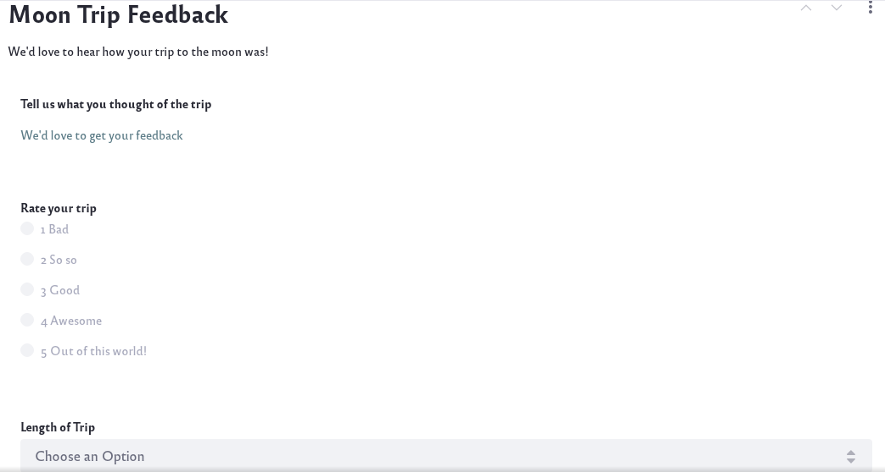
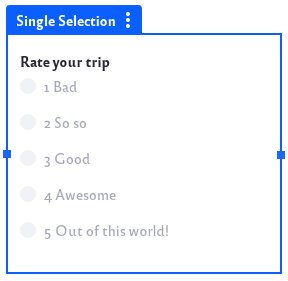

# Customizing Form Layouts

By default, new elements on your form are added to a new row and occupy the entire width of the form. 

Sometimes it doesn't make sense to have each element oriented on separate rows. Instead, you can save space by modifying the width of elements and placing them in a single row.

To change the width of an element, move your cursor to the sides of the element until the edges are highlighted. Drag one of the blue squares to change the width.

Reducing the width of an element frees up space on the row, potentially for other elements.

Move your cursor toward the label of another element. Drag the element onto the same row as the previous element.
