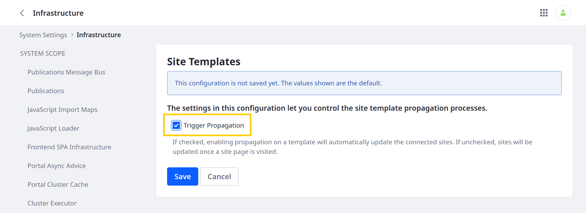

# Configuring Propagation of Site Template Changes

{bdg-secondary}`Available for Liferay 7.4 U_+ and GA_+`
<!--CONFIRM VERSION-->

With Site Templates, you can configure the trigger for Site Template propagation. By default, Liferay triggers propagation for each Site individually when it is first visited by a user after changes are published. However, you can configure your system to trigger propagation to all connected Sites immediately after publishing.

```{note}
Keep in mind that triggering propagation immediately after publishing can be resource intensive, since all Sites using the template are updated simultaneously.
```

Follow these steps:

1. Open the *Global Menu* (), go to the *Control Panel* tab, and click *System Settings*.

1. Go to *Infrastructure* settings and click *Site Templates* in the side menu.

1. Check *Trigger Propagation* to trigger propagation to all connected Sites immediately after publishing.

   

1. Click *Save*.

If propagation is enabled for a Site Template, publishing changes to it immediately begins propagating the changes to connected Sites in the background. <!--ALT: If propagation is enabled for a Site Template, Liferay immediately beings to propagate those changes to connected Sites in the background.-->

## Additional Information

* [Building Sites with Templates](./building-sites-with-site-templates.md)
* [Merging Site Template Changes](./merging-site-template-changes.md)
