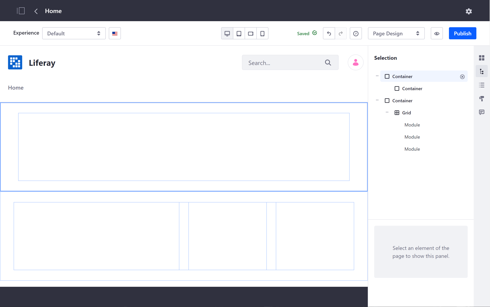
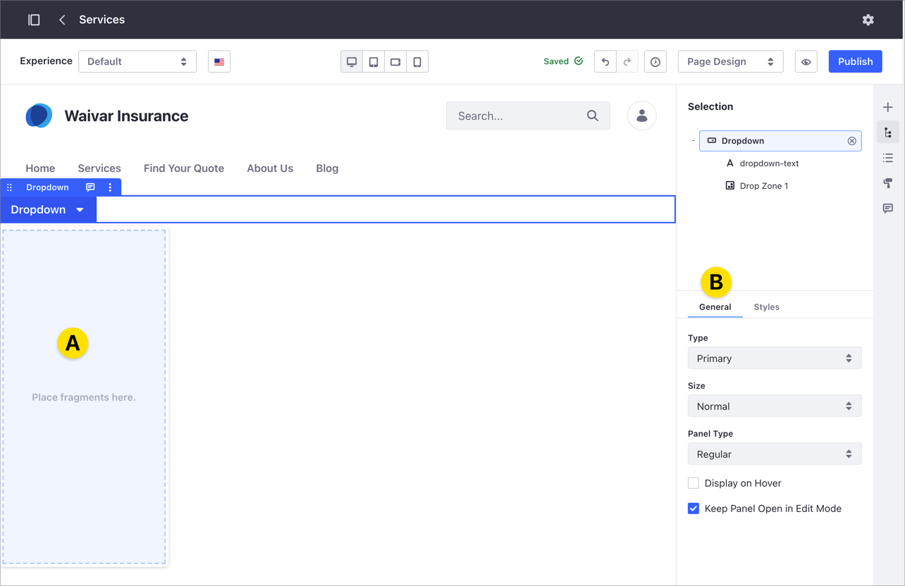
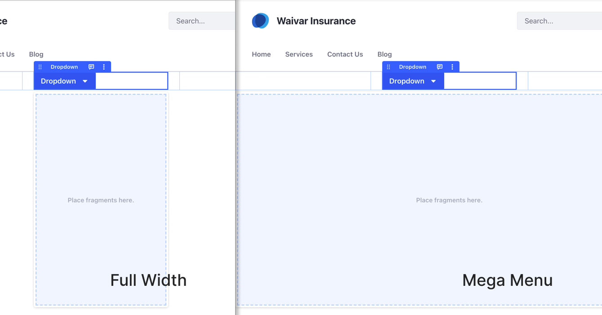
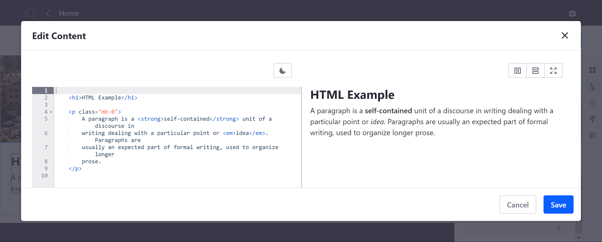
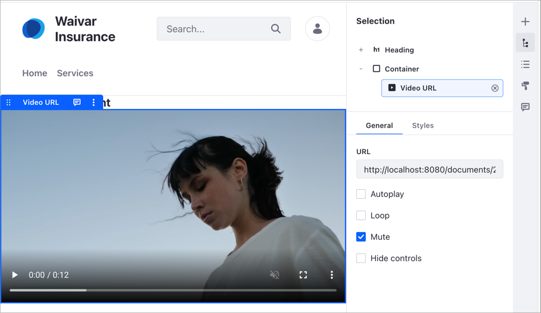
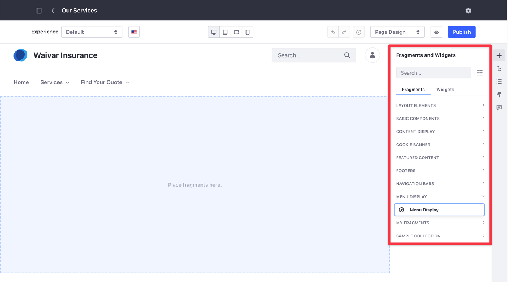

# Page Fragments User Interface Reference

To access available Fragments, go to a Content Page, and click on the *Edit* icon () in the Application Bar. Ensure your edit mode is set to *Page Design* and click on *Fragment and Widgets* () in the editing Sidebar Menu.

- [Adding Fragments](#adding-fragments)
- [Configuring Fragments](#configuring-fragments)
- [Using Layout Elements](#layout-elements)
- [Using Basic Components](#basic-components)
- [Using Content Display Fragments](#content-display)
- [Using Featured Content Components](#featured-content)
- [Using Footers](#footers)
- [Using Navigation Bars](#navigation-bars)
- [Using Menu Displays](#menu-display)

## Adding Fragments

1. While editing a Content Page, open the *Fragment and Widgets* () panel in the editing Sidebar Menu.

1. Drag and drop a Fragment to the desired location in your page layout.

Once added, you can change its placement at any time. You can also view its placement in your page's structure as well as access its configuration options in the *Selection* panel () of the editing Sidebar Menu.

## Configuring Fragments

Liferay DXP provides options for configuring individual Fragments as well as their sub-elements. These options can vary, though some are common to all. You can view available configuration options in the *Selection* panel () of the Sidebar Menu. Click on a Fragment or element and select which options you'd like to configure from the available tabs.

```{note}
You can also localize some Fragment settings for the target audience's language. To learn more, see [Localizing the Fragment Configuration](../../displaying-content/using-fragments/localizing-the-fragment-configuration.md).
```

### General

Here you can configure Fragment specific options (e.g., heading level, video URL, button type).

### Styles

Here you can configure standard Fragment options (e.g., dimensions, background, borders), as well as Fragment specific options on occasion. With DXP's Responsive Layout Editor, you can also configure these settings for different devices. See [Configuring Fragment Styles](../../displaying-content/using-fragments/configuring-fragment-styles.md) and [Fragment Styles Reference](../../displaying-content/using-fragments/fragment-styles-reference.md) for more information.

### Image Source

Here you can select an element's image, view its resolution, and provide its alt text.

### Link

Here you can either manually add a URL to a page element, or select from an available content field. You can also specify the desired target (e.g., self, parent).

### Mapping

Here you can map page elements to available assets by selecting the desired item (e.g., web content article, document, blog) and specifying which of its fields to display in the element (e.g., title, author, name).

## Layout Elements

> Available: Liferay Portal 7.3 GA2+; previously called Layouts with *panels* and *rows*.

*Layout Elements* define drop zones and can be used to create the desired page structure. DXP's default layout Fragments include *Containers* and *Grids*. Once configured, you can drag and drop widgets or other Fragments into the defined areas, including additional containers or grids to create even more complex structures.



### Container

Use *container* Fragments to add drop zones to a Content Page. In addition to standard style options, this field can be configured to maintain a fixed width or to adapt to fill the width of its page section. You can also set a container's Link field to add either internal or external links. Once published, clicking on the name of the fragment redirects users to your specified destination.

### Grid

Use *grid* Fragments to add multiple drop zone modules to a Content Page. These modules can be arranged into rows and columns. In addition to standard style options, you can determine the number of modules for each grid, the number of modules per row, and the vertical alignment of each module's content. You can also manually [adjust the width](./configuring-elements-on-content-pages.md#configuring-the-grid-fragment) of each module.

## Basic Components

These are simple design elements that add basic functionality to a page. Examples include buttons, headings, and tabs. With these Components, you can build your page piece by piece. DXP includes the following Basic Components.

### Button

Use *button* Fragments to add link elements to a Content Page. As part of configuration, choose from one of four available button styles.


### Card

Use *card* Fragments to add an image with title, paragraph, and link elements to a Content Page.


### Dropdown

> Available: Liferay DXP/Portal 7.4+.

This Fragment defines a drop zone where you can add other Fragments and create advanced drop-down menus (A). For example, you can drag-and-drop a Card Fragment on the Dropdown Fragment's drop zone so the Card content appears when the user clicks or hovers over the Dropdown.



In this table you can see a description of the Dropdown Fragment General options (B):

| Option | Description |
| :--- | :--- |
| *Type* | Controls the Dropdown Fragment style. |
| *Size* | Sets the Dropdown Fragment size. |
| *Panel Type* | Defines the drop zone size:</br><ul><li>*Regular:* Standard drop zone size.</li><li>*Full Width:* The drop zone size corresponds to the Module's width containing the Fragment.</li><li>*Mega Menu:* The drop zone size corresponds to the Page's width.</li></ul> |
| *Display on Hover* | When you check this option, the Dropdown Fragment opens on mouse-over. |
| *Keep Panel Open in Edit Mode* | Check this option to keep the drop-zone open while you edit the Dropdown Fragment content. |



```{tip}
Place the Dropdown Fragment inside a Grid Fragment to observe the differences between the *Full Width* and *Mega Menu* panel types.
```

### External Video

> Available: Liferay DXP/Portal 7.4+.

Use the *External Video* Fragment to embed additional video sources in your Content Page. You can use a valid URL or videos in [Documents and Media](../../../content-authoring-and-management/documents-and-media.html). The supported sources include YouTube, Facebook, Twitch, Vimeo, and videos stored in Documents and Media.


```{note}
The External Video Fragment does not support video controls for autoplay, loop, or mute. If you don't need these controls in the Content Page, use the External Video Fragment. If you need to provide these controls, use the [Video URL Fragment](#video-url) instead.
```

### Heading

Use *heading* Fragments to add H1-H6 header text to a Content Page.


### HTML

Use *HTML* Fragments to add an editable HTML element to a Content Page. Double-clicking on it opens a modal window where you can edit its content using HTML syntax.



### Image

Use *image* Fragments to add a configurable `image-square` element to a Content Page. As part of configuration, determine whether to use the image's original size, or adjust it to fit its context. To select an image, determine its resolution, and set its alt text, go to the `image-square` element's *Image* tab.

### Paragraph

Use *paragraph* Fragments to add a simple text element to a Content Page, which can be configured using standard style options and mapped to available content.

### Separator

Use *separator* Fragments to add a horizontal line between Fragments on a page. As part of configuration, you can determine its spacing and color.

### Slider

Use *slider* Fragments to add image slides with text overlay to a Content Page. Each slide consists of image, title, and subtitle elements.


### Social

Use the *social* Fragment to add Facebook, Twitter, and LinkedIn icons for linking to pages on each platform. You can also change each icon for different social media platforms.


### Spacer

Use *spacer* Fragments to add horizontal blank space between Fragments on a page. As part of configuration, you can adjust its height.

### Tabs

Use the *tabs* Fragment to add multiple tabs with individual drop zones for widgets and other Fragments. Determine number of tabs, as well as standard style options.


### Video URL

> The Video URL Fragment is called Video Fragment in Liferay versions previous to Liferay DXP 7.4.

Use the *Video URL* Fragment to embed videos in your Content Page. To select a video, enter a valid URL, either to YouTube or a video file. As part of the Fragment configuration, you can set the video to autoplay, loop, or mute. You can also choose to hide the video controls.



## Content Display

> Available: Liferay DXP/Portal 7.3+

Use *Content Display* Fragments to display Site content individually or as part of a collection. Examples include web content, blog entries, and documents. You can also add page elements for rating or flagging page content. DXP includes the following Content Display Fragments.

### Content Display

Use the *content display* Fragment to display a single content item on a Content Page. As part of configuration, determine whether it displays your selected content using the *Abstract* or *Title* template.

### Content Flags

Use the *content flag* Fragment to add a page element for flagging inappropriate content. As part of configuration, map it to content and determine its message.

### Content Ratings

Use the *content ratings* Fragment to add a page element for rating content. As part of configuration, link it with the desired content item.

### Collection Display

Use the *collection display* Fragment to display asset collections on Content Pages. With it, you can choose from both manually and dynamically defined collections, as well as those defined by a Collection Provider. You can then choose whether a collection is displayed in a *grid* or with a list *template* (i.e., bordered, bulleted, inline, numbered, and unstyled). See [Displaying Collections](../../displaying-content/additional-content-display-options/displaying-collections.md) for more information.

## Featured Content

*Featured Content* Fragments are complex page elements composed of multiple components. To preview a Fragment's layout, hover over its *Information* icon (). DXP includes the following Featured Content Fragments.

### Banners

Use *banner* Fragments to add text and link elements to a Content Page for creating CTA (Call to Action) banners. DXP includes the following layouts.


### Features

Use the *features* Fragment to add text, images, and link elements to a Content Page for promoting key features. DXP includes the following layout:


### Highlights

Use the *highlights* Fragment to add image, text, and link elements to a Content Page for highlighting. DXP provides the following layouts.


## Footers

> Available: Liferay DXP 7.3+; previously included in the *Sections* panel.

Use *Footer* Fragments to add a custom footer to [Master Page Templates](../defining-headers-and-footers/master-page-templates.md) for Content Pages. Each footer includes a navigation menu, sign-in link, image element, and copyright text. DXP includes the following layouts for Footer Fragments:


## Navigation Bars

> Available: Liferay DXP 7.3+; previously included in the *Sections* panel.

Use *Navigation Bar* Fragments to add a custom header to [Master Page Templates](../defining-headers-and-footers/master-page-templates.md) for Content Pages. Each navigation bar includes a navigation menu, sign-in link, and image element for your logo. DXP includes the following layouts for Navigation Bar Fragments:


## Menu Display

> Available: Liferay DXP/Portal 7.4+.

Using the Menu Display Fragment, you can create a navigation menu anywhere in your Content Page. This navigation menu is based on your Site's Public or Private Pages hierarchy, or any other hierarchy you define using Liferay DXP  [Navigation Menus](../../site-navigation/using-the-navigation-menus-application.md). To learn more about how to configure the Menu Display Fragment for your Site navigation, read [Managing Site Navigation](../../site-navigation/managing-site-navigation.md).



## Additional Information

- [Content Pages Overview](./content-pages-overview.md)
- [Content Page Editor User Interface Reference](./content-page-editor-user-interface-reference.md)
- [Using Page Fragments](../../displaying-content/using-fragments/using-page-fragments.md)
- [Managing Site Navigation](../../site-navigation/managing-site-navigation.md)
