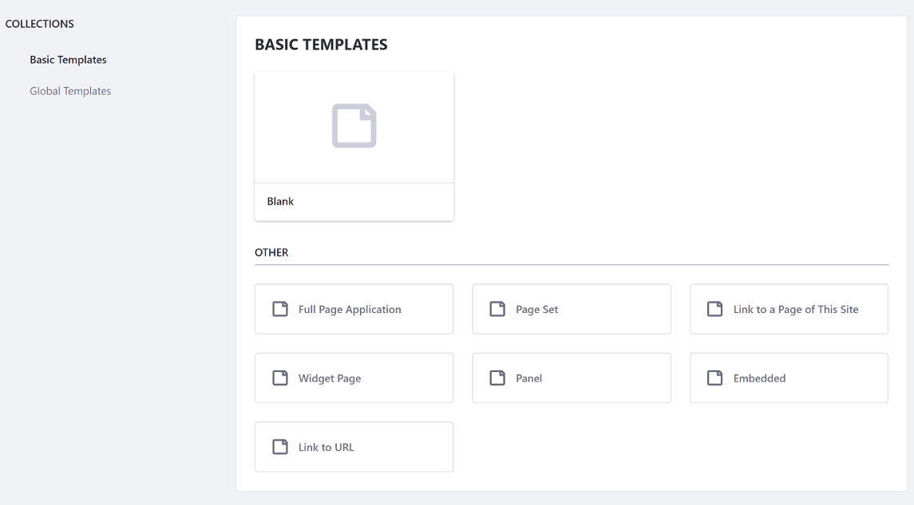
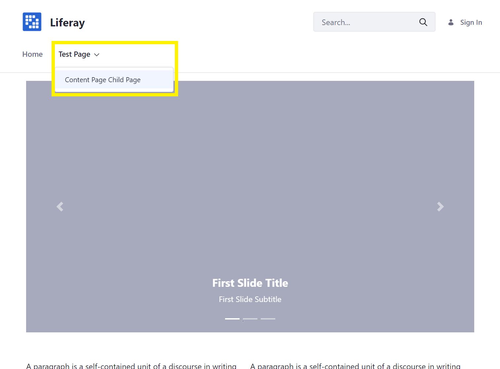

# Understanding Pages

Pages on Liferay DXP are primarily used to display content and applications to users of a Site.

## Page Sets

When adding Pages to a site, the pages are created as part of a Site's [Page Set](../page-settings/configuring-page-sets.md): **Public Pages** or **Private Pages**. Public and Private Page Sets are compared below:

| Behavior | Public Pages | Private Pages |
| :--- | :--- |---|
| Visible to unauthenticated users | &#10004; |  |
| Viewing requires Login and Site Membership |  | &#10004; |
| Distinct URL pattern | &#10004; | &#10004; |

## Page Types

There are several page types available when you [add a page](../adding-pages/adding-a-page-to-a-site.md). The default page type is a **Content Page**. You can also create a page based on a [Page Template](../adding-pages/creating-a-page-template.md). Page Types and Page Templates are described in more detail below.



```{tip}
The Page Type of the currently viewed page appears at the top of the page to help you determine the administration options you have and where you need to go to configure the page.
```

### Content Pages

Content Pages enable users to build professional pages that can be easily managed and have their content edited in-line on the fly. Content Pages are primarily built using [Page Fragments](../page-fragments-and-widgets/using-fragments.md), but also allow widgets.



Using Content Pages allows access to additional powerful features and benefits:

* [Personalized and Adaptive Site Experiences](../../personalizing-site-experience/personalizing-site-experience.md)
* [A/B Testing](../../optimizing-sites/ab-testing/ab-testing.md)
* Approachable Content and Site Building Experience

To learn more about Content Pages, see the [Using Content Pages](../using-content-pages.md). To jump right into building one, see [Adding Elements to Content Pages](../using-content-pages/adding-elements-to-content-pages.md).

### Widget Pages

<!-- Should there be an article that covers layouts and layout templates? -->

A Widget Page is a page with a set layout that allows *widgets* (applications) to be displayed. Widgets can display content or add interactive and dynamic functionality to the page. When you first start Liferay Portal, the starting home page is a Widget Page. See [Adding Widgets to a Page](../using-widget-pages/adding-widgets-to-a-page.md) for more information.


### Content Pages and Widget Pages Compared

This table compares some of the distinctions between a Content Page and a Widget Page:

| Feature |  Content Pages | Widget Pages |
| :--- | :--- |---|
| Ability to Add Widgets | &#10004; | &#10004; |
| Personalized Site Experiences | &#10004; |  |
| Access to A/B Testing | &#10004; |  |
| Easy Layout and Content Editing | &#10004; |  |
| Advanced Custom Layouts |  | &#10004; |
| User-Customizable Columns |  | &#10004; |
| Staging Page Variations |  | &#10004; |

### Other Page Types

There are several other page types that are available - each can help to satisfy particular use cases. See [Other Page Types](../understanding-pages/other-page-types.md) for more information.

## Global Page Templates

When adding a page, you also have the option to choose a Page Template. Page Templates are pre-set pages with applications already deployed to the page. By default, only *Global Templates* are available, but additional collections you create appear as an option as well.

| Global Page Template | Description |
| :--- | :--- |
| Blog | Creates a Widget Page with a Blogs widget, a Tag Cloud widget, and a Recent Bloggers widget. |
| Search | Creates a Widget Page with a Search Bar widget, a Search Results widget, and a Search Options widget. |
| Wiki | Creates a Widget Page with a Wiki widget, a Category Filter widget, and a Tag Filter widget. |

Learn more about Page Templates:

* Adding a Page Using a Page Template
* [Creating a Page Template](../adding-pages/creating-a-page-template.md)

## Child Pages and Page Hierarchy

Pages can also be created in a hierarchical fashion by creating Child Pages. Child Pages can be useful if you have multiple pages that can be organized into categories.


```{tip}
You can navigate among pages of a Site hierarchy with the Site Map application. A Site Administrator can configure a root page and a display depth. The display depth of the Site Map application determines how many levels of nested pages to display.
```

## Related Information

* [Adding a Page](../adding-pages/adding-a-page-to-a-site.md)
* [Configuring Individual Pages](../page-settings/configuring-individual-pages.md)
* [Enabling User Personalization of Widget Pages](../using-widget-pages/enabling-user-personalization-of-widget-pages.md)
