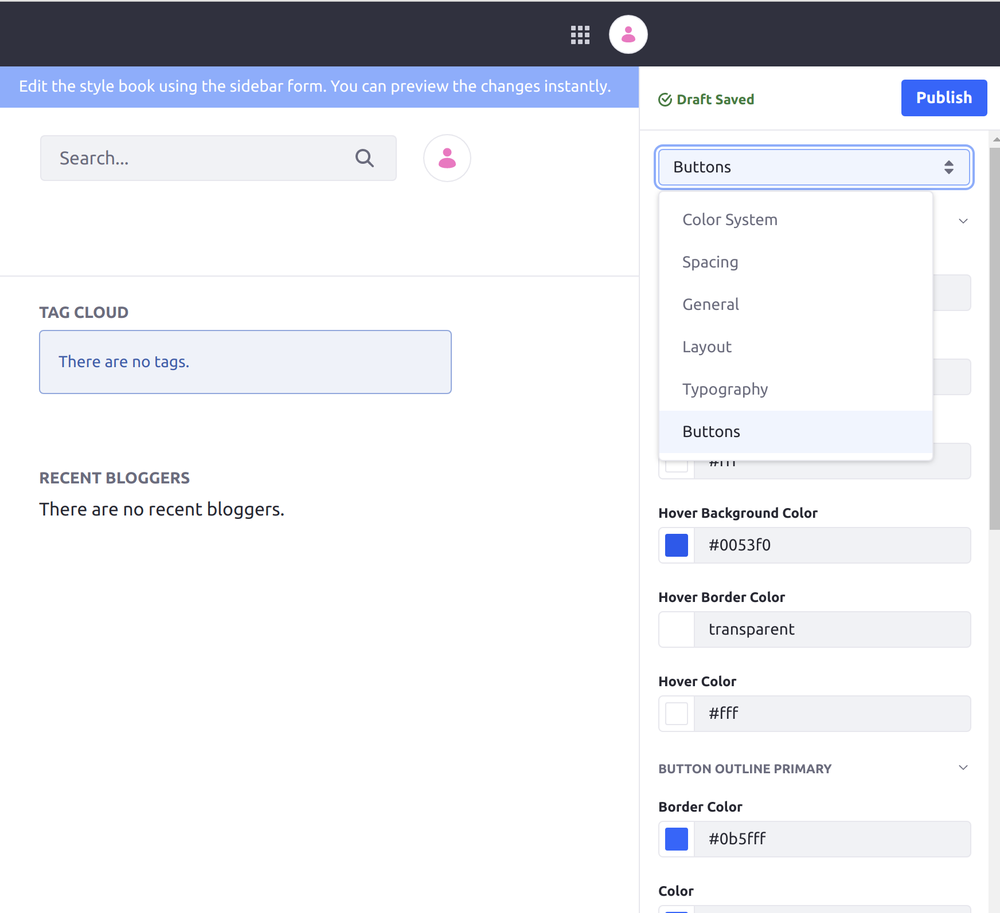
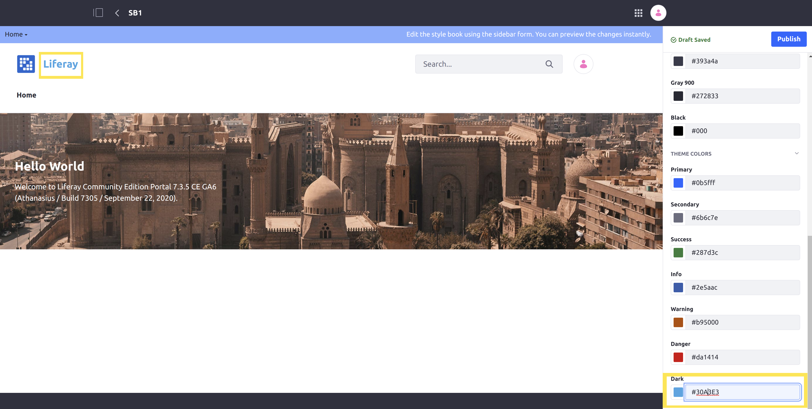
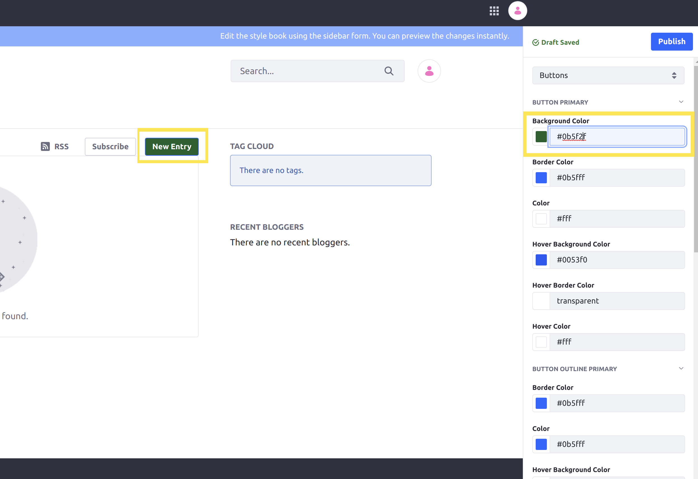

# Using a Style Book to Standardize Site Appearance

{bdg-secondary}`Available 7.3+`

A *Style Book* is a set of visual rules that apply to a Site to provide a consistent experience across its pages. They determine various visual settings on the Site, including spacing between elements (such as widgets), colors, and fonts. Each of these settings applies equally to every page using the Style Book.

The theme you assign to your Site's Pages determines the categories of settings available to the Style Books for your Site. Developers can customize the categories with new options for configuring Style Books. See [Style Book Token Definitions](./developer-guide/style-book-token-definitions.md) for more information.

## Choosing a Style Book for a Page

If you do not choose a specific Style Book for a page, the page uses the Style Book for the [Master Page](../../creating-pages/defining-headers-and-footers/master-page-templates.md). If neither are set, the page uses the default Style Book for the Site.

```{note}
From Liferay 7.4 U10+ and GA14+, every Site has at least one Style Book available called *Styles from Theme*. This Style Book uses the token definition defined in the theme, with all of the default values. This Style Book cannot be edited, and it is the default used for the Site if no other Style Book is configured.
```

Follow these steps to set any page's Style Book:

1. Click *Edit* () near the top of the page.

1. Click *Page Design Options* () on the sidebar.

1. Click to open the *Style Book* tab.

    

1. Select the desired Style Book from the list.

1. Click *Publish*.

The page is published using the new Style Book.

## Creating a New Style Book

1. Navigate to the *Site Menu* &rarr; *Design* &rarr; *Style Books*.

1. Click *Add* () near the top of the page.

1. Enter a name for the Style Book and click *Save*.

1. Change the options from the categories in the drop-down box in the menu on the right side of the screen.

   

   These options come from the theme being used for your Site. See the [default Classic theme categories](#default-classic-theme-categories) for more information on the categories available for the default Classic theme.

1. Customize any of the provided fields given under the chosen category. Color fields specifically give you [multiple ways to choose a color](#customizing-your-style-book-s-colors).

1. Click *Publish*.

The Style Book can now be selected as an option for any page when editing.

To make this Style Book the new default for your Site, open the Actions menu () beside the newly created Style Book and click *Mark as Default*.

### Previewing a Style Book

{bdg-secondary}`Available 7.4 DXP U9+ or GA13+`

While you are creating or editing a Style Book, you can preview the way it affects the look of various components of your Site, including pages, Page Templates, and Page Fragments.

Use the two drop-down menus at the top of the screen to select what components to preview. The left drop-down menu determines the overall type to display (pages, Page Templates, Master Page Templates, Display Page Templates, or Page Fragments). The right drop-down menu determines which specific instance of the chosen type to display (or category, if applicable); only the four most recently used options are shown in the right drop-down menu, unless you click *More* from the list.



Previewing a Collection of Page Fragments shows all Fragments in the Collection. The preview displays Fragments with multiple (selectable) configuration options with an instance of each option, so that you can preview your Style Book with any of them.


### Customizing Your Style Book's Colors

When you are choosing a color for any color field in your Style Book, you can choose the color in multiple ways:

* Click the color on the left side to open a color picker, and choose any color.

* Enter the hex code for the desired color into the text box to change to any color.

* Click the *Value from Stylebook* button to open a menu of pre-defined colors to choose from. You can choose to reuse colors from each of the general categories that you can customize.



If you click the Value from Stylebook button and select a Style Book token value (that is also defined in another category), then that color field is linked to the chosen Style Book token. Any future changes to the token value for this Style Book will also change this color field.

When a color field is tied to a Style Book token, the Value from Stylebook button is replaced with a *Detach Token* button. Click this button to detach the color field from the token (but keep the same color value).


```{note}
Attaching or detaching a color value to a Style Book token requires Liferay DXP 7.4 U10+ or GA14+.
```

Click the *Clear Selection* button on the right side to reset the color back to the default value (defined in the theme).

```{note}
When you are editing colors from a Style Book on a specific page, you have the same options to choose a color. However, clicking the *Clear Selection* button instead resets the color value to the default defined in the chosen *Style Book*.
```

## Default Classic Theme Categories

When you are editing a Style Book, the categories available from the drop-down box show different options for styling your pages. The options available in each category are defined by the theme.

```{tip}
You can place the `Style Guide Sample` widget on your pages to help test out the various options in your Style Book categories. This sample widget contains many different UI elements that leverage most of the features in the Classic theme, so you can use it to test your page styles. 
```

The categories listed here are available as options for the Classic theme.

### Color System

The colors used for fonts and visual elements defined in your theme are customizable in the Color System category. Generally, this means you can modify the body, background, and text colors on your pages.


```{note}
Changing the colors for alert-related elements (such as *Success* or *Warning*) may not affect the color of incoming alerts on your Site because each type of alert may use one of many colors. To fully customize the color of alerts, you must define customizable colors and use them in your own theme's categories.
```

### Spacing

Adjust the spacing between the main elements on your pages with the options in the Spacing category. When you configure a Page Fragment using the corresponding Style Book, these values are given as options for the Fragment's margin and padding sizes.

### General

These options modify color and spacing on elements that appear on every page of your Site. For example, the *Body Background* option changes the background color of all pages.


### Layout

These options modify the width of containers on your pages. For example, the default container on new Blank pages is configurable via the size of the Extra Large setting.

### Typography

These options define new fonts for your pages. You can also adjust the size of headers via the options in this category.

### Buttons

These options modify the style for the default types of buttons. You can customize the background, foreground, and border colors for each of the buttons used in the Classic theme.


## Additional Information

* [Style Book Token Definitions](./developer-guide/style-book-token-definitions.md)
* [Adding a New Token Set for Your Style Book](./developer-guide/adding-a-new-token-set-for-your-style-book.md)
